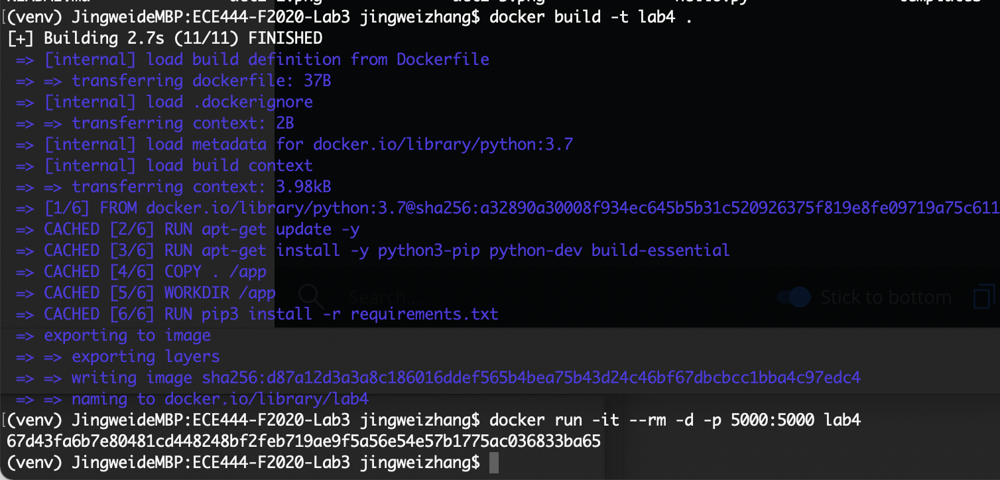
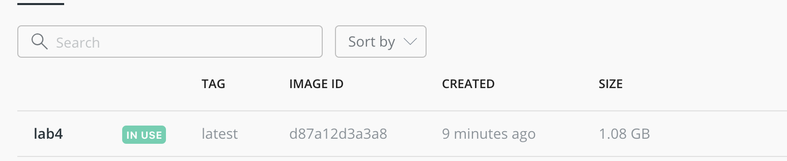
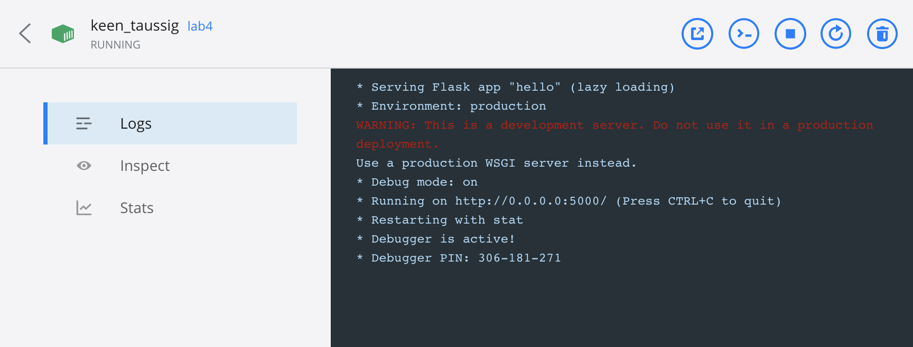
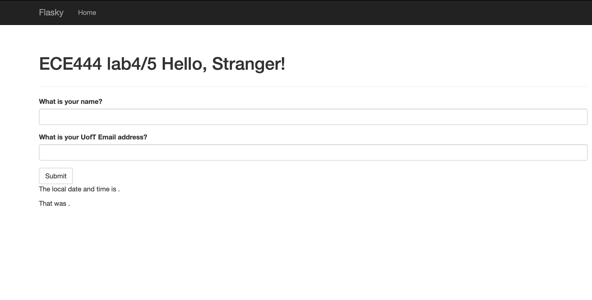
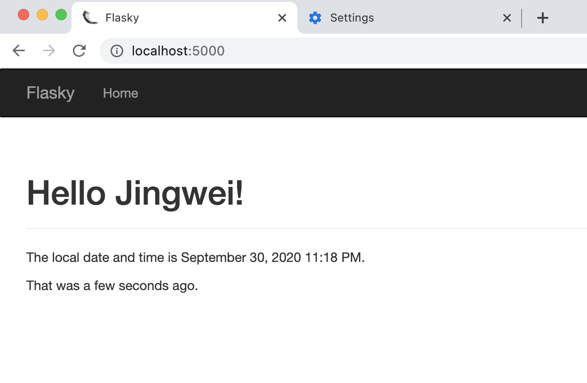
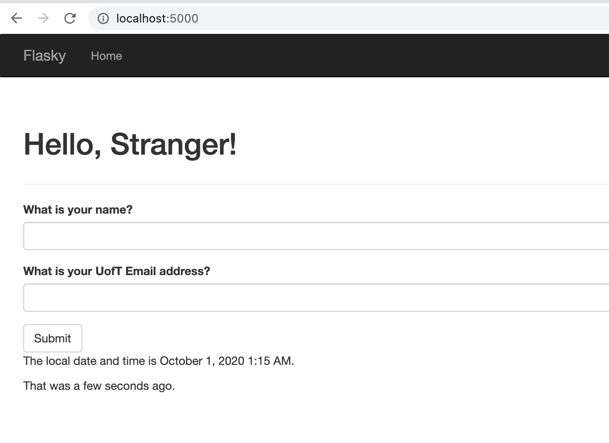
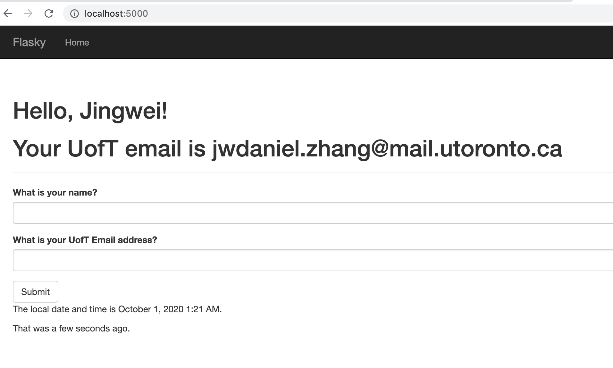
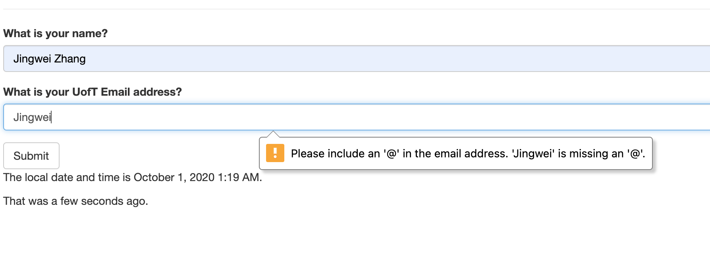
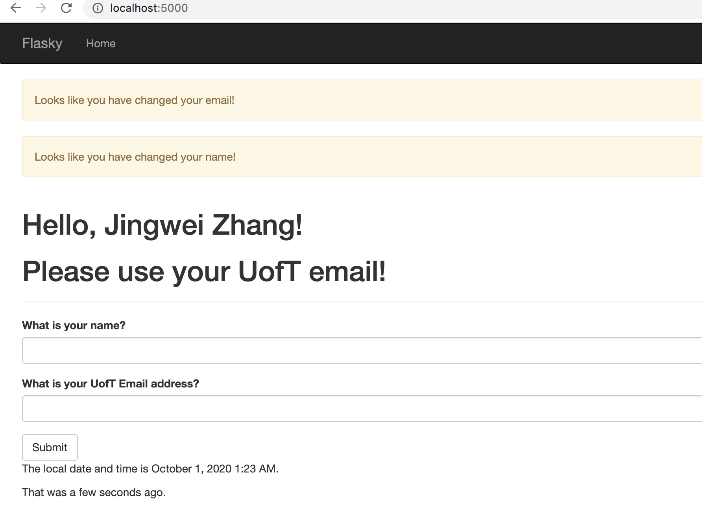

Created by Jingwei Zhang. this repo is a clone of
https://github.com/miguelgrinberg/flasky

Lab4:

Part3: 
Virtual machine requires a hypervisor to run a guest Operating system. It's not flexible and consumes large overheads
Docker is a light weight native tool running on Linux. It's a process that share a kernel. It uses less memory

---------------------------------
Lab3:
Activity1: 

Activity2:

Activity3:
SQL is relational and have structured data while NoSQL is not
SQL preserves consistency while NoSQL relax the consistency requirements

